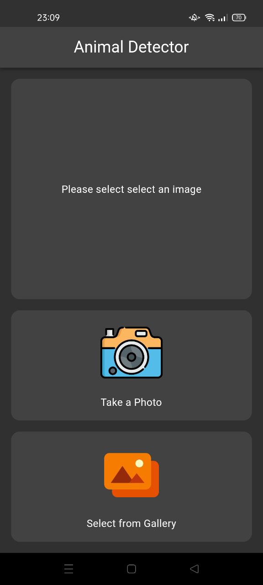

# Animal Detector
Animal detection with Flutter and TFLite. Animal Detector makes it possible to identify animals in 10 different categories, including cat, dog, spider, sheep butterfly, horse squirrel, cow, chicken and elephant.

# Steps
- import the dataset from kaggle.
- dataset comprising approximately 28,000 medium-quality animal images, encompassing ten distinct categories.
- The app allows users to capture images using their device's camera or select images from the gallery. The images are then processed by a machine learning model trained on a 
  dataset using Convolutional Neural Networks (CNN) and Google Inception , has allowed the app to achieve an accuracy of up to 98% using Google Inception and 82% using Cnn 
  respectively.
. The app accurately classifies the captured or selected image into the corresponding 
  animal category present in the dataset.
- Run the project on Android Studio or Visual Studio.
- capture images using their device's camera or select images from the gallery.
- The classification accuracy is displayed on the device screen.

 


## Data set
- [Kaggle](https://www.kaggle.com/datasets/alessiocorrado99/animals10)

## Preview
<p align='center'>
    
    
    
</p>

##### This project contains generated files. Don't forget to run scripts below before running the project.
```sh
sh scripts/build_runner.sh
sh scripts/flutter_gen.sh
```
